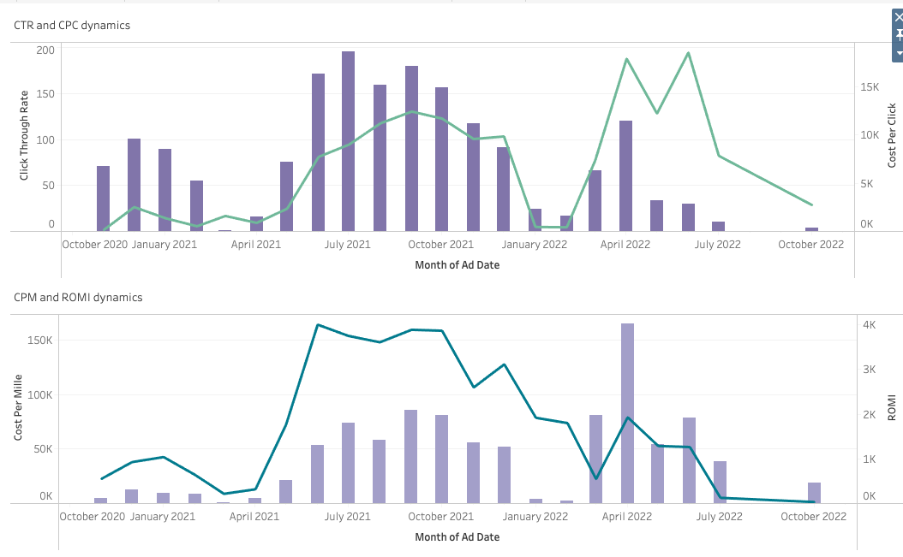

# Google-Facebook-Ads-Campaigns
This project demonstrates how to combine advertising data from Google Ads and Facebook Ads, clean and transform it, and calculate key marketing performance metrics using SQL.

## Project Goals
- Integrate raw data from two different advertising platforms (Google Ads and Facebook Ads).
- Extract UTM parameters (especially `utm_campaign`) from ad URLs.
- Aggregate daily results and compute core marketing metrics.
- Ensure robust calculations by handling division-by-zero and invalid values.

## Data
Two sample datasets are provided (all data is fictitious for demonstration purposes):
- `google_ads_data.csv`
- `facebook_ads_data.csv`

Each file contains the following columns:
- `ad_date` – date of the campaign
- `campaign_id` - unique id of the campaign
- `adset_id`/`adset_name` - unique id/name of the adset
- `spend` – ad spend in USD
- `impressions` – number of impressions
- `reach` – audience reached
- `clicks` – number of clicks
- `leads` – number of conversions/leads
- `value` – monetary value generated by ads
- `url_parameters` – contains UTM tags

## Key Steps
1. **Combine Google and Facebook Ads data** using `UNION ALL` inside a Common Table Expression (CTE).
2. **Parse UTM parameters** with SQL regex and a custom PostgreSQL function (`decode_utm_campaign_2`).
3. **Aggregate metrics by date and campaign**:
   - CTR (Click-Through Rate)
   - CPC (Cost per Click)
   - CPM (Cost per Mille)
   - ROMI (Return on Marketing Investment)
4. **Handle edge cases** (e.g., missing UTM tags, `NaN` values, zero impressions or clicks).

## Results
The output table provides daily performance by `utm_campaign`, including:
- total spend
- total impressions
- total clicks
- total value
- calculated KPIs (CTR, CPC, CPM, ROMI)

## Outputs

The full interactive version can be viewed at: [Open Tableau Dashboard](https://public.tableau.com/app/profile/olena.ryzuk/viz/MarketingKPIs_17566738708590/MarketingKPIs?publish=yes)

## Conclusion
- CTR showed significant drops in March–April 2021 and January–February 2022.
- In 2022, CPC increased while CTR decreased, indicating that marketing campaigns became less effective.
- CPM rose in 2022, accompanied by a decrease in ROMI.
  
## Skills Demonstrated
- SQL: CTEs, aggregations, regex parsing, user-defined functions (PL/pgSQL)
- Data cleaning and transformation
- Marketing analytics and KPI calculation

## Recommendations
- Optimize ad spend to reduce CPC while improving CTR.
- Focus on campaigns with higher ROMI and consider reallocating budget from low-performing campaigns.

## Usage
1. Load the CSV files into a PostgreSQL database.
2. Run the SQL scripts in order:
   - `01_combine_ads.sql`
   - `02_metrics.sql`
   - `03_decode_function.sql`
3. The final query aggregates metrics by date and campaign.
